# The Four Pillars of Physical AI in 2025

## Architecture Overview

Modern Physical AI systems are built on four interconnected pillars, each serving a critical function in the development-to-deployment pipeline:

```mermaid
graph TD
    ROS2["🤖 ROS 2 Humble<br/>Robot Operating System<br/>Middleware & Control"]
    SIM["🎮 Gazebo & Isaac Sim<br/>Physics Simulation<br/>Sim-to-Real Transfer"]
    ISAAC["⚡ Isaac ROS<br/>GPU-Accelerated Perception<br/>cuVSLAM, DetectNet"]
    VLA["🧠 VLA Models<br/>Vision-Language-Action<br/>LLM Orchestration"]

    ROS2 --> SIM
    ROS2 --> ISAAC
    ROS2 --> VLA
    SIM --> ISAAC
    SIM --> VLA
    ISAAC --> VLA

    style ROS2 fill:#4A90E2,stroke:#2E5C8A,stroke-width:3px,color:#fff
    style SIM fill:#7B68EE,stroke:#4B3A9E,stroke-width:3px,color:#fff
    style ISAAC fill:#50C878,stroke:#2E7D4E,stroke-width:3px,color:#fff
    style VLA fill:#FF6B6B,stroke:#C93A3A,stroke-width:3px,color:#fff
```



---

## Pillar 1: ROS 2 Humble — The Nervous System

### What is ROS 2?

**ROS 2 (Robot Operating System 2)** is an open-source middleware framework that provides:
- **Communication**: Publish-subscribe messaging (topics), request-response (services), long-running tasks (actions)
- **Hardware Abstraction**: Unified interfaces for sensors (cameras, lidars, IMUs) and actuators (motors, grippers)
- **Control**: Joint controllers, trajectory planners, inverse kinematics solvers
- **Tooling**: Visualization (RViz2), data logging (ROS bags), simulation integration

**Why ROS 2 Humble (2022-2027 LTS)?**
- **Long-Term Support (LTS)**: 5-year maintenance cycle, critical for production robotics
- **Ubuntu 22.04 LTS Compatibility**: Industry standard Linux distribution for robotics
- **Real-Time Performance**: DDS middleware (FastDDS, Cyclone DDS) for 1ms latency communication
- **Security**: DDS Security (SROS2) with encrypted messages and authentication

### Key ROS 2 Concepts

**Nodes**: Independent processes that perform specific tasks (e.g., camera driver, path planner, object detector)

**Topics**: Data streams where nodes publish/subscribe (e.g., `/camera/image_raw`, `/cmd_vel`, `/joint_states`)

**Actions**: Long-running tasks with feedback and cancel support (e.g., `/navigate_to_pose`, `/follow_joint_trajectory`)

**TF Tree**: Coordinate frame transformations (e.g., `map` → `odom` → `base_link` → `camera_link`)

### Example: ROS 2 Architecture for Humanoid Robot

```
[Camera Node] → /camera/image_raw → [Object Detector Node]
                                            ↓
[Nav2 Stack]  → /cmd_vel → [Base Controller] → [Motor Drivers]
                                            ↓
[SLAM Node] → /map → [Path Planner] → /plan → [Trajectory Executor]
```

### Learn More
- [ROS 2 Humble Documentation](https://docs.ros.org/en/humble/) | [Archive](https://archive.is/PLACEHOLDER_ROS2_DOCS)
- Book Chapter: Module 02 covers ROS 2 fundamentals with hands-on examples

---

## Pillar 2: Gazebo & Isaac Sim — The Training Ground

### Why Simulation Matters

Developing robotics algorithms on real hardware is:
- **Expensive**: Breaking a $50K humanoid during testing is costly
- **Dangerous**: Testing autonomous navigation indoors risks collisions
- **Slow**: Collecting 10,000 training examples on real robot takes months

**Simulation solves this**: Test algorithms safely, generate synthetic data at 1000x real-time speed, and transfer learned behaviors to real robots with **sim-to-real techniques**.

### Gazebo Classic & Gazebo Harmonic

**Gazebo** (formerly Gazebo Classic, now Ignition Gazebo/Gazebo Harmonic) is the de facto standard for ROS robotics simulation.

**Features**:
- **Physics Engines**: ODE, Bullet, DART for realistic contact dynamics
- **Sensor Simulation**: Cameras, lidars, depth sensors, IMUs with configurable noise models
- **ROS 2 Integration**: `ros_gz_bridge` for seamless topic/service bridging
- **Plugin System**: Custom sensors, actuators, world dynamics (e.g., randomized lighting)

**Best For**: Wheeled robots, mobile manipulators, rapid prototyping

### NVIDIA Isaac Sim

**Isaac Sim** is a **GPU-accelerated** robotics simulator built on NVIDIA Omniverse.

**Features**:
- **Photorealistic Rendering**: RTX ray tracing for synthetic data generation (RGB, depth, segmentation masks)
- **PhysX 5**: NVIDIA's GPU physics engine for parallel simulation (100+ robots in one scene)
- **Domain Randomization**: Built-in tools for randomizing object poses, lighting, textures (critical for sim-to-real)
- **ROS 2 Native Support**: Isaac ROS bridge for perception pipelines

**Best For**: Vision-based manipulation, sim-to-real transfer, large-scale synthetic data generation

### Gazebo vs. Isaac Sim Comparison

| Feature | Gazebo Harmonic | Isaac Sim 2024.1.1 |
|---------|-----------------|-------------------|
| **Physics Engine** | ODE/Bullet/DART | PhysX 5 (GPU) |
| **Rendering** | OGRE (CPU) | RTX Ray Tracing (GPU) |
| **ROS 2 Integration** | ros_gz_bridge | Isaac ROS Bridge |
| **GPU Acceleration** | Limited | Full (physics + rendering) |
| **Learning Curve** | Moderate | Steep (Omniverse ecosystem) |
| **Cost** | Open-source (free) | Free (NVIDIA account required) |
| **Best Use Case** | Navigation, controls | Vision, manipulation, sim-to-real |

**Recommendation**: Use **both**. Start with Gazebo for basic robot development, then migrate to Isaac Sim when you need GPU-accelerated perception and domain randomization for sim-to-real transfer.

### Learn More
- [Gazebo Documentation](https://gazebosim.org/docs) | [Archive](https://archive.is/PLACEHOLDER_GAZEBO_DOCS)
- [Isaac Sim 2024.1.1 Docs](https://docs.omniverse.nvidia.com/isaacsim/latest/index.html) | [Archive](https://archive.is/PLACEHOLDER_ISAACIM_DOCS)
- Book Chapter: Module 02 (Gazebo), Module 03 (Isaac Sim)

---

## Pillar 3: Isaac ROS — The Sensory System

### GPU-Accelerated Perception

**Isaac ROS** is NVIDIA's suite of **GPU-accelerated perception packages** for ROS 2, optimized for Jetson hardware.

**Why GPU Acceleration?**
- **Real-Time Performance**: Process 30 FPS camera streams with 50ms latency (critical for manipulation)
- **Edge Deployment**: Run complex perception on power-constrained Jetson devices (15W-25W)
- **Parallel Processing**: Detect 100+ objects simultaneously, track 1000+ features for SLAM

### Key Isaac ROS Packages

#### 1. cuVSLAM (Visual SLAM)
**Purpose**: Localization and mapping using stereo or RGB-D cameras

**Features**:
- GPU-accelerated feature tracking (2500+ features at 30 FPS)
- Loop closure detection for drift correction
- Odometry output for Nav2 integration

**Use Case**: Indoor navigation, autonomous exploration, warehouse robots

**Performance** (RealSense D435, Jetson Orin Nano 8GB):
- Latency: 35-45ms per frame
- Memory: ~2.5GB GPU
- Accuracy: less than 2% trajectory error (VIO Benchmark)

#### 2. DetectNet (Object Detection)
**Purpose**: Real-time object detection with bounding boxes

**Features**:
- Pre-trained models: PeopleNet, TrafficCamNet, custom training
- TensorRT INT8 inference (25-30 FPS on Jetson Orin)
- Confidence thresholding and NMS (Non-Maximum Suppression)

**Use Case**: Person detection, object picking, autonomous driving

**Performance** (640x480 input, Jetson Orin Nano):
- Latency: 28-35ms per frame
- Throughput: 28 FPS
- Precision: 85-90% (indoor, well-lit)

#### 3. Depth Processing
**Purpose**: Convert depth images to point clouds for obstacle avoidance

**Features**:
- GPU-accelerated point cloud generation
- Temporal and spatial filtering for noise reduction
- Integration with Nav2 costmap

**Use Case**: Obstacle avoidance, terrain mapping, manipulation

### Isaac ROS vs. Traditional Perception

| Metric | OpenCV (CPU) | Isaac ROS (GPU) |
|--------|-------------|-----------------|
| SLAM Feature Tracking | 10-15 FPS | 30 FPS |
| Object Detection (YOLO) | 5-8 FPS | 28 FPS |
| Depth Processing | 12 FPS | 30 FPS |
| Power Consumption | 25W (Jetson) | 18W (Jetson, optimized) |

**Result**: 2-3x speedup + 30% power savings

### Learn More
- [Isaac ROS Documentation](https://nvidia-isaac-ros.github.io/) | [Archive](https://archive.is/PLACEHOLDER_ISAAC_ROS_DOCS)
- Book Chapter: Module 04 (Isaac ROS perception pipelines)

---

## Pillar 4: VLA Models — The Brain

### Vision-Language-Action Models

**VLA Models** are **multimodal foundation models** that can:
1. **Understand** natural language commands ("Pick up the red mug")
2. **Perceive** visual scenes (RGB images, point clouds)
3. **Generate** robot control actions (joint trajectories, gripper commands)

**Example**: RT-2 (Robotics Transformer 2) from Google DeepMind

**Input**: "Move the apple to the left of the banana" + RGB image of table
**Output**: 7-DoF arm trajectory to execute the task

### How VLA Models Work

**Training Pipeline**:
1. **Web-scale pre-training**: Learn from billions of images + text (ImageNet, LAION-5B)
2. **Robot demonstration data**: Fine-tune on 100K+ robot episodes (pick/place, navigation)
3. **Reinforcement learning** (optional): Self-improvement through trial-and-error in simulation

**Inference Pipeline**:
1. Encode language command → text embeddings
2. Encode camera image → visual embeddings
3. Decode to robot action → joint positions, velocities, gripper state

### Popular VLA Models (2025)

#### RT-2 (Google DeepMind, 2023)
- **Architecture**: Vision Transformer (ViT) + T5 language model
- **Training Data**: Web (ImageNet) + 100K robot episodes
- **Performance**: 55% success rate on novel objects (vs. 30% for RT-1)

#### PaLM-E (Google, 2023)
- **Architecture**: PaLM (540B params) + ViT image encoder
- **Training Data**: Web + robot + multimodal data
- **Performance**: 93% success on simple manipulation tasks

#### OpenVLA (Open-source, 2024)
- **Architecture**: LLaMA-2 13B + CLIP vision encoder
- **Training Data**: Open X-Embodiment dataset (1M+ episodes)
- **Performance**: 48% success on Open-X benchmark (comparable to RT-2)

### LLM Orchestration for Robotics

Beyond end-to-end VLA models, **LLMs can orchestrate** robot actions by:
1. Parsing natural language into structured tasks
2. Decomposing complex tasks into atomic actions
3. Generating Python code that calls robot APIs

**Example**: "Go to the kitchen and pick up the bottle"

**LLM Output (Python)**:
```python
robot.navigate_to("kitchen")
robot.detect_objects()  # Returns: bottle at (x=1.2, y=0.5, z=0.3)
robot.move_arm_to(x=1.2, y=0.5, z=0.3, approach="top")
robot.open_gripper()
robot.close_gripper()  # Grasp
robot.move_arm_to(x=0, y=0, z=0.5)  # Lift
```

**Advantages**:
- No robot-specific training required (use off-the-shelf GPT-4o, Claude)
- Interpretable outputs (can debug Python code)
- Easy integration with existing ROS 2 systems

**Disadvantages**:
- Higher latency (~1-2 seconds for LLM inference)
- Requires structured robot APIs (not end-to-end perception → action)

### Learn More
- [RT-2 Paper](https://robotics-transformer2.github.io/) | [Archive](https://archive.is/PLACEHOLDER_RT2)
- [PaLM-E Paper](https://palm-e.github.io/) | [Archive](https://archive.is/PLACEHOLDER_PALME)
- Book Chapter: Module 07 (VLA models and LLM orchestration)

---

## How the Pillars Work Together

### Example Workflow: Household Cleaning Robot

**User Command** (via VLA): "Clean the living room table"

**1. Language Understanding (Pillar 4 - VLA)**
- Parse command → Task: Clean table in living room
- Decompose → Subtasks: Navigate to living room, detect table, move objects to sink

**2. Navigation (Pillar 1 - ROS 2 + Pillar 3 - Isaac ROS)**
- cuVSLAM localizes robot in house map
- Nav2 path planner generates collision-free path
- Base controller executes velocity commands

**3. Perception (Pillar 3 - Isaac ROS)**
- DetectNet detects objects on table (cups, plates, utensils)
- Depth processing generates point cloud for grasp planning

**4. Manipulation (Pillar 1 - ROS 2)**
- MoveIt2 plans arm trajectory to grasp first object
- Gripper closes, arm lifts object
- Robot navigates to sink, places object

**5. Sim-to-Real Validation (Pillar 2 - Simulation)**
- Before deployment, test workflow in Isaac Sim with 100+ randomized scenarios
- Measure success rate, identify failure modes
- Iterate on perception thresholds, grasp poses

---

## Why This Stack Wins in 2025

**Ecosystem Maturity**: ROS 2 Humble has 5 years of community support, 10,000+ packages, enterprise adoption (BMW, Amazon, Cruise).

**GPU Acceleration**: Isaac ROS + Isaac Sim leverage NVIDIA's CUDA ecosystem, 10x faster than CPU-based alternatives.

**Foundation Model Integration**: VLA models (RT-2, OpenVLA) are pre-trained on web-scale data, require minimal robot-specific fine-tuning.

**Sim-to-Real Success**: Isaac Sim's domain randomization + PhysX 5 enable 70-90% sim-to-real transfer rates (vs. 30-50% for older simulators).

**Industry Momentum**: NVIDIA Jetson Orin (2M+ units shipped), Tesla Optimus (500K pre-orders), Figure AI ($650M Series B)—all built on this stack.

---

## Next Steps

Now that you understand the four pillars, you're ready to:

1. **Install the stack**: [Ubuntu + ROS 2 Setup](./ubuntu-ros2-setup.md)
2. **Configure Isaac Sim**: [Isaac Sim Installation](./isaac-sim-installation.md)
3. **Verify your environment**: [Verification & Testing](./verification-testing.md)

---

**Previous**: [Introduction](./index.md) | **Next**: [Repository Structure](./repository-structure.md)
