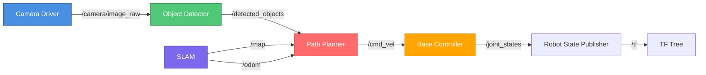

# ROS 2 Architecture Deep Dive

## From Monolith to Microservices: The ROS 2 Design Philosophy

Unlike traditional robotics frameworks that use a single monolithic process, ROS 2 adopts a **distributed microservices architecture**. Each capability (sensor driver, perception, planning, control) runs as an independent **node** that communicates via standardized **topics, services, and actions**.

**Why this matters**: You can develop, test, and deploy nodes independently. Swap out a camera driver without recompiling your entire codebase. Run perception on a GPU server while control runs on the robot's embedded computer.

---

## Layer 1: DDS Middleware — The Communication Backbone

### What is DDS?

**DDS (Data Distribution Service)** is an OMG (Object Management Group) standard for real-time, peer-to-peer communication in distributed systems.

**Key Characteristics**:
- **Publish-Subscribe**: Data producers (publishers) don't know about consumers (subscribers)
- **Discovery**: Nodes automatically discover each other on the network (no central broker)
- **Quality of Service (QoS)**: Fine-grained control over reliability, latency, resource usage
- **Security**: Built-in authentication, encryption, access control (DDS-Security)

**Think of DDS as**: A "super-powered UDP" with reliability guarantees, automatic discovery, and enterprise-grade security.

### Why ROS 2 Chose DDS

ROS 1 used a custom TCP/UDP-based middleware (TCPROS/UDPROS) with limitations:
- **Single Master Node**: Failure of `roscore` = entire system down
- **No Real-Time Guarantees**: Variable latency, no priority handling
- **Limited Security**: Unencrypted messages, no authentication

ROS 2 solved this by adopting DDS:
- **No Single Point of Failure**: Decentralized discovery
- **Real-Time Performance**: Submillisecond latency with DDS real-time profile
- **Production-Ready Security**: DDS-Security used in aerospace, defense, medical devices

### DDS Implementations in ROS 2

ROS 2 supports multiple DDS implementations (called **RMW** - ROS Middleware):

| DDS Implementation | Vendor | Best For |
|-------------------|--------|----------|
| **FastDDS** (default) | eProsima | General-purpose, good performance |
| **Cyclone DDS** | Eclipse Foundation | Low latency, resource-constrained systems |
| **Connext DDS** | RTI | Industrial, safety-critical (paid) |
| **Gurum DDS** | Gurum Networks | Korean market, automotive |

**Recommendation**: Use **FastDDS** (default) for learning. Switch to **Cyclone DDS** for Jetson deployment (lower memory usage).

### Switching DDS Implementations

```bash
# Check current RMW
echo $RMW_IMPLEMENTATION

# Use Cyclone DDS (install first)
sudo apt install ros-humble-rmw-cyclonedds-cpp
export RMW_IMPLEMENTATION=rmw_cyclonedds_cpp

# Use FastDDS (default)
export RMW_IMPLEMENTATION=rmw_fastrtps_cpp
```

**Performance Comparison** (RTT latency, 100 KB message):
- **FastDDS**: 120-150 µs
- **Cyclone DDS**: 80-110 µs (25% faster)

---

## Layer 2: ROS 2 Node Graph

### What is a Node?

A **node** is an independent process that performs a specific task:
- Camera driver node: Publishes images at 30 Hz
- Object detector node: Subscribes to images, publishes bounding boxes
- Motion planner node: Subscribes to goal pose, publishes velocity commands

**Design Principle**: One node = one responsibility (Unix philosophy: do one thing well)

### Example Node Graph: Humanoid Navigation



**Key Observations**:
1. **Loose Coupling**: Object detector doesn't know who consumes `/detected_objects`
2. **Parallel Processing**: SLAM and camera can run on different CPUs/GPUs
3. **Reusability**: Swap object detector (YOLO → DetectNet) without touching other nodes

---

## Communication Patterns

### 1. Topics (Publish-Subscribe)

**Use Case**: Continuous data streams (sensor data, robot state, commands)

**Characteristics**:
- **Many-to-many**: Multiple publishers, multiple subscribers
- **Fire-and-forget**: Publishers don't wait for acknowledgment
- **Real-time friendly**: Low latency (submillisecond)

**Example**: Camera publishing images

```python
# Publisher (camera_driver.py)
import rclpy
from sensor_msgs.msg import Image

class CameraDriver(rclpy.node.Node):
    def __init__(self):
        super().__init__('camera_driver')
        self.publisher = self.create_publisher(Image, '/camera/image_raw', 10)
        self.timer = self.create_timer(0.033, self.publish_image)  # 30 Hz

    def publish_image(self):
        msg = Image()
        # Fill message with camera data...
        self.publisher.publish(msg)
```

```python
# Subscriber (image_viewer.py)
import rclpy
from sensor_msgs.msg import Image

class ImageViewer(rclpy.node.Node):
    def __init__(self):
        super().__init__('image_viewer')
        self.subscription = self.create_subscription(
            Image, '/camera/image_raw', self.image_callback, 10)

    def image_callback(self, msg):
        # Process received image...
        self.get_logger().info(f'Received image: {msg.width}x{msg.height}')
```

**When to Use Topics**:
- ✅ Sensor data (cameras, lidars, IMUs)
- ✅ Robot state (joint positions, velocities)
- ✅ Control commands (velocity, joint targets)

### 2. Services (Request-Response)

**Use Case**: One-time queries or commands with response

**Characteristics**:
- **One-to-one**: One client → one server
- **Synchronous**: Client blocks until response (or timeout)
- **Reliable**: Response guaranteed (or error returned)

**Example**: Querying robot pose

```python
# Service server (localization_node.py)
from geometry_msgs.srv import GetPose

class LocalizationNode(rclpy.node.Node):
    def __init__(self):
        super().__init__('localization')
        self.srv = self.create_service(GetPose, '/get_pose', self.get_pose_callback)

    def get_pose_callback(self, request, response):
        # Compute current pose...
        response.pose.position.x = 1.5
        response.pose.position.y = 2.3
        return response
```

```python
# Service client (controller.py)
from geometry_msgs.srv import GetPose

class Controller(rclpy.node.Node):
    def __init__(self):
        super().__init__('controller')
        self.client = self.create_client(GetPose, '/get_pose')
        self.client.wait_for_service(timeout_sec=5.0)

    def request_pose(self):
        request = GetPose.Request()
        future = self.client.call_async(request)
        rclpy.spin_until_future_complete(self, future)
        pose = future.result().pose
        self.get_logger().info(f'Current pose: ({pose.position.x}, {pose.position.y})')
```

**When to Use Services**:
- ✅ Querying state ("what is my battery level?")
- ✅ Triggering actions ("save map", "reset odometry")
- ✅ Configuration ("set parameter", "change mode")

### 3. Actions (Long-Running Tasks with Feedback)

**Use Case**: Goals that take time and need progress updates

**Characteristics**:
- **Goal-Feedback-Result**: Client sends goal → server sends feedback → server sends result
- **Cancelable**: Client can cancel goal mid-execution
- **Asynchronous**: Client doesn't block, receives feedback via callbacks

**Example**: Autonomous navigation

```python
# Action server (navigation_node.py)
from nav2_msgs.action import NavigateToPose
import rclpy.action

class NavigationNode(rclpy.node.Node):
    def __init__(self):
        super().__init__('navigation')
        self.action_server = rclpy.action.ActionServer(
            self, NavigateToPose, '/navigate_to_pose', self.navigate_callback)

    def navigate_callback(self, goal_handle):
        # Execute navigation, send feedback periodically
        for progress in range(0, 100, 10):
            feedback = NavigateToPose.Feedback()
            feedback.distance_remaining = 10.0 - (progress / 10.0)
            goal_handle.publish_feedback(feedback)
            time.sleep(0.5)  # Simulate navigation

        goal_handle.succeed()
        result = NavigateToPose.Result()
        result.success = True
        return result
```

**When to Use Actions**:
- ✅ Navigation to a goal pose
- ✅ Grasping an object (approach, close gripper, lift)
- ✅ Multi-step manipulation tasks

---

## Quality of Service (QoS) Profiles

### The Problem: One Size Doesn't Fit All

**Scenario 1**: Camera streaming (30 FPS)
- Need: Low latency, tolerate occasional dropped frames
- Approach: **Best-effort delivery**

**Scenario 2**: Safety commands (emergency stop)
- Need: 100% delivery guarantee
- Approach: **Reliable delivery**

**QoS Profiles** let you configure this trade-off **per topic**.

### QoS Policies

#### 1. Reliability
- **BEST_EFFORT**: Fast, no retransmission (UDP-like)
- **RELIABLE**: Guaranteed delivery, retransmit on loss (TCP-like)

**Example**:
```python
from rclpy.qos import QoSProfile, QoSReliabilityPolicy

# Sensor data (tolerate drops for low latency)
qos_sensor = QoSProfile(
    reliability=QoSReliabilityPolicy.BEST_EFFORT,
    depth=10
)

# Safety commands (never drop)
qos_safety = QoSProfile(
    reliability=QoSReliabilityPolicy.RELIABLE,
    depth=10
)

pub = self.create_publisher(Image, '/camera/image', qos_sensor)
```

#### 2. Durability
- **VOLATILE**: Only send to subscribers connected **now**
- **TRANSIENT_LOCAL**: Cache last N messages for late-joiners

**Use Case**: Map data (late-joining nodes should receive the current map)

```python
from rclpy.qos import QoSDurabilityPolicy

qos_map = QoSProfile(
    durability=QoSDurabilityPolicy.TRANSIENT_LOCAL,
    depth=1  # Keep last map
)
```

#### 3. History
- **KEEP_LAST**: Buffer last N messages (e.g., depth=10)
- **KEEP_ALL**: Buffer everything (risky for high-frequency topics)

#### 4. Deadline
- **Duration**: Expected maximum time between messages
- **Action**: Log warning if exceeded (for monitoring)

```python
from rclpy.duration import Duration

qos_heartbeat = QoSProfile(
    deadline=Duration(seconds=1)  # Expect message every 1s
)
```

### QoS Presets

ROS 2 provides common presets:

```python
from rclpy.qos import qos_profile_sensor_data, qos_profile_system_default

# For sensor data (best-effort, volatile)
pub_camera = self.create_publisher(Image, '/camera', qos_profile_sensor_data)

# For general data (reliable, volatile)
pub_pose = self.create_publisher(PoseStamped, '/pose', qos_profile_system_default)
```

### QoS Compatibility Rules

**Publisher and subscriber QoS must be compatible**:

| Publisher | Subscriber | Compatible? |
|-----------|------------|-------------|
| RELIABLE | RELIABLE | ✅ Yes |
| RELIABLE | BEST_EFFORT | ✅ Yes |
| BEST_EFFORT | RELIABLE | ❌ No |
| BEST_EFFORT | BEST_EFFORT | ✅ Yes |

**Debugging QoS Mismatches**:
```bash
ros2 doctor --report
# Look for: "Qos incompatibility detected"
```

---

## The TF Tree: Coordinate Frame Management

### What is TF?

**TF (Transform)** manages coordinate frame relationships in 3D space.

**Example Humanoid TF Tree**:
```
map
 └─ odom
     └─ base_link
         ├─ left_arm
         │   └─ left_hand
         ├─ right_arm
         │   └─ right_hand
         └─ head
             └─ camera_optical_frame
```

**Use Case**: "Where is the object in the camera frame relative to the robot's hand?"

```python
import tf2_ros
from geometry_msgs.msg import TransformStamped

# Look up transform
tf_buffer = tf2_ros.Buffer()
tf_listener = tf2_ros.TransformListener(tf_buffer, self)

transform = tf_buffer.lookup_transform(
    'left_hand',  # Target frame
    'camera_optical_frame',  # Source frame
    rclpy.time.Time()  # Latest transform
)
```

**Key Insight**: TF automatically chains transforms (`camera → base_link → left_hand`) even if no direct transform exists.

---

## Discovery and Domain IDs

### How Nodes Find Each Other

**DDS Discovery**:
1. New node broadcasts: "I exist and publish `/camera/image`"
2. Other nodes respond: "I'm interested in `/camera/image`"
3. DDS establishes direct peer-to-peer connection (no broker)

**Network Protocol**: Multicast UDP on ports 7400-7500

### Domain IDs: Isolating Robot Fleets

**Problem**: Multiple robots on the same network see each other's topics.

**Solution**: Assign different **ROS Domain IDs** (0-101 reserved, 102-232 custom).

```bash
# Robot 1
export ROS_DOMAIN_ID=42
ros2 run my_pkg my_node

# Robot 2 (different domain, isolated)
export ROS_DOMAIN_ID=43
ros2 run my_pkg my_node
```

**Use Case**: Amazon warehouse with 1000 robots—each robot uses its own domain ID.

---

## Performance Tuning

### Latency Benchmarks (Ubuntu 22.04, i7-12700)

| Message Size | FastDDS | Cyclone DDS |
|-------------|---------|-------------|
| 1 KB | 80 µs | 60 µs |
| 100 KB | 150 µs | 110 µs |
| 1 MB | 800 µs | 650 µs |

### Optimization Tips

1. **Use Zero-Copy for Large Messages** (Humble 1.2+):
   ```bash
   export RMW_FASTRTPS_USE_INTRA_PROCESS=1
   ```

2. **Tune DDS Thread Pools**:
   ```xml
   <!-- fastdds.xml -->
   <profiles>
       <transport_descriptors>
           <transport_descriptor>
               <transport_id>udp_transport</transport_id>
               <type>UDPv4</type>
               <maxMessageSize>65500</maxMessageSize>
           </transport_descriptor>
       </transport_descriptors>
   </profiles>
   ```

3. **Monitor with `ros2 topic hz`**:
   ```bash
   ros2 topic hz /camera/image_raw
   # Expected: 30.0 Hz ± 1%
   ```

---

## Security: DDS-Security (SROS2)

### Why Secure ROS 2?

**Threats**:
- Rogue nodes publishing fake sensor data
- Unauthorized control commands (hijack robot)
- Eavesdropping on sensitive data

**Solution**: SROS2 (Secure ROS 2) with DDS-Security.

### Enabling SROS2

```bash
# Generate keys
ros2 security create_keystore ~/sros2_keys
ros2 security create_enclave ~/sros2_keys /my_robot/my_node

# Run with security
export ROS_SECURITY_KEYSTORE=~/sros2_keys
export ROS_SECURITY_ENABLE=true
export ROS_SECURITY_STRATEGY=Enforce
ros2 run my_pkg my_node
```

**Result**: All messages encrypted (AES-256), nodes authenticated (X.509 certs).

---

## Troubleshooting Common Issues

### Issue 1: Nodes Can't Discover Each Other

**Symptoms**: `ros2 node list` doesn't show expected nodes.

**Causes**:
- Different ROS domain IDs
- Firewall blocking UDP multicast
- RMW implementation mismatch

**Solutions**:
```bash
# Check domain ID
echo $ROS_DOMAIN_ID

# Allow multicast (Ubuntu)
sudo ufw allow from 224.0.0.0/4

# Check RMW
echo $RMW_IMPLEMENTATION
```

### Issue 2: QoS Mismatch

**Symptoms**: Subscriber receives no data despite publisher running.

**Diagnosis**:
```bash
ros2 doctor --report
# Look for "Qos incompatibility"
```

**Solution**: Match QoS profiles (see compatibility table above).

### Issue 3: High Latency

**Symptoms**: `ros2 topic hz` shows irregular rates.

**Causes**:
- CPU overload (check `htop`)
- Large messages on slow network
- DDS tuning needed

**Solutions**:
- Reduce message frequency
- Switch to Cyclone DDS
- Enable zero-copy

---

## External Resources

### Official Documentation
- [ROS 2 Concepts](https://docs.ros.org/en/humble/Concepts.html) | [Archive](https://archive.is/PLACEHOLDER_ROS2_CONCEPTS)
- [DDS-Security Spec](https://www.omg.org/spec/DDS-SECURITY/) | [Archive](https://archive.is/PLACEHOLDER_DDS_SECURITY)
- [RMW Implementation Guide](https://docs.ros.org/en/humble/Concepts/Intermediate/About-Different-Middleware-Vendors.html) | [Archive](https://archive.is/PLACEHOLDER_RMW_GUIDE)

### Research Papers
- [Design of the ROS 2 Middleware](https://design.ros2.org/articles/ros_middleware_interface.html) | [Archive](https://archive.is/PLACEHOLDER_RMW_DESIGN)

---

**Previous**: [Introduction](./index.md) | **Next**: [Workspace Setup](./workspace-setup.md)
