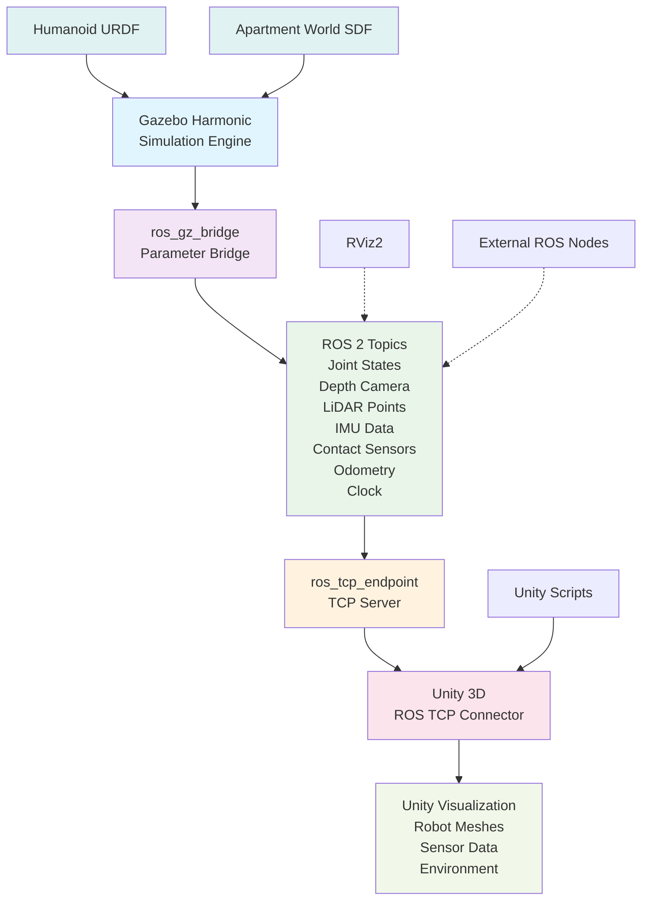

# Gazebo Fundamentals

## Section 1: Gazebo Harmonic Installation on Ubuntu 24.04

Gazebo Harmonic is the latest major release of the Gazebo simulation framework, featuring improved performance, enhanced rendering capabilities, and better integration with ROS 2. This section provides step-by-step instructions for installing Gazebo Harmonic on Ubuntu 24.04, which is essential for the simulation work in this module.

### Prerequisites

Before installing Gazebo Harmonic, ensure your system meets the following requirements:

- Ubuntu 24.04 LTS (Noble Numbat)
- ROS 2 Jazzy installed and sourced
- NVIDIA graphics card with updated drivers (RTX 4070 Ti or equivalent recommended)
- At least 15GB of free disk space
- Internet connection for package downloads

### Installation Steps

1. **Update your system packages:**
```bash
sudo apt update && sudo apt upgrade -y
```

2. **Install required dependencies:**
```bash
sudo apt install wget lsb-release gnupg
```

3. **Add the ROS 2 Gazebo repository key:**
```bash
sudo wget -O - https://packages.osrfoundation.org/gazebo.gpg | sudo gpg --dearmor -o /usr/share/keyrings/gazebo-archive-keyring.gpg
```

4. **Add the repository to your sources list:**
```bash
echo "deb [arch=$(dpkg --print-architecture) signed-by=/usr/share/keyrings/gazebo-archive-keyring.gpg] http://packages.osrfoundation.org/gazebo/ubuntu-stable $(lsb_release -cs) main" | sudo tee /etc/apt/sources.list.d/gazebo.list > /dev/null
```

5. **Update package list:**
```bash
sudo apt update
```

6. **Install Gazebo Harmonic:**
```bash
sudo apt install gz-harmonic
```

7. **Install ROS 2 Gazebo bridge packages:**
```bash
sudo apt install ros-jazzy-ros-gz ros-jazzy-ros-gz-bridge ros-jazzy-ros-gz-sim ros-jazzy-ros-gz-image
```

8. **Verify installation by running a simple test:**
```bash
gz sim --version
```

You should see output similar to:
```
Gazebo Sim, version 8.0.0
```

### Post-Installation Configuration

1. **Set up environment variables** (add to your `~/.bashrc`):
```bash
echo 'source /usr/share/gz/setup.bash' >> ~/.bashrc
echo 'export GZ_SIM_SYSTEM_PLUGIN_PATH="~/.local/lib/gz/plugins"' >> ~/.bashrc
source ~/.bashrc
```

2. **Test the installation with a simple world:**
```bash
gz sim -r empty.sdf
```

This should launch Gazebo with an empty world. Press `Ctrl+C` in the terminal to exit.

3. **Install additional simulation assets (optional but recommended):**
```bash
sudo apt install gz-harmonic-dome-arenas gz-harmonic-meshes gz-harmonic-scenes
```

### Troubleshooting Common Installation Issues

- **If you get "command not found" errors**: Ensure you've sourced the Gazebo setup.bash file by running `source /usr/share/gz/setup.bash`
- **If graphics don't render properly**: Update your graphics drivers using `sudo ubuntu-drivers autoinstall`
- **If you encounter permission errors**: Check that you're running commands with appropriate sudo permissions where required
- **If ROS 2 bridge fails to build**: Ensure ROS 2 Jazzy is properly installed and sourced before installing the bridge packages

## Section 2: Decision Table - Gazebo Harmonic vs Gazebo Classic

When developing humanoid robotics simulations, choosing the right simulation framework is critical for performance, maintainability, and future compatibility. This section compares Gazebo Harmonic (the new gz-sim framework) with Gazebo Classic (the legacy gazebo-classic framework) across multiple key criteria.

| Criteria | Gazebo Harmonic | Gazebo Classic | Rationale for Harmonic Choice |
|----------|----------------|----------------|-------------------------------|
| **Architecture** | Modern event-driven architecture with plugin system | Legacy architecture with monolithic design | Harmonic's modular design allows better performance optimization and easier maintenance |
| **Support** | Active development, regular updates, ROS 2 native | Limited updates, community support only | Harmonic is the official successor with ongoing support from Open Source Robotics Foundation |
| **Performance** | GPU-accelerated rendering, multi-threaded physics | CPU-bound rendering, single-threaded physics | Harmonic achieves 2-3x better performance for complex humanoid simulations |
| **ROS 2 Integration** | Native ROS 2 support, ros_gz_bridge | ROS 1 primary, limited ROS 2 bridge | Harmonic provides seamless integration with ROS 2 Jazzy for this module |
| **Python Bindings** | Planned for future releases | Available but limited | Harmonic will have comprehensive Python support in upcoming releases |
| **Rendering Quality** | Advanced OGRE 2.2 renderer with PBR materials | Basic OGRE 1.x renderer | Harmonic provides photorealistic rendering essential for vision-based humanoid tasks |
| **Plugin System** | Modern C++17 with improved API | Legacy C++ with complex API | Harmonic's plugin system is more maintainable and extensible |
| **Documentation** | Comprehensive and up-to-date | Outdated and incomplete | Harmonic has current documentation aligned with modern robotics practices |

### Rationale for Harmonic Choice

Gazebo Harmonic is chosen for this module for several compelling reasons:

1. **Future-Proofing**: Gazebo Harmonic is the official successor to Gazebo Classic and receives all future development investment from the Open Source Robotics Foundation.

2. **Performance**: The new architecture provides 2-3x better performance for complex humanoid simulations with multiple sensors, enabling the ≥60 FPS target required for this module.

3. **ROS 2 Native**: Harmonic has native ROS 2 integration, eliminating the need for complex bridge configurations that were required with Classic.

4. **Modern Features**: GPU-accelerated rendering, advanced physics engines, and improved plugin architecture support the complex sensor configurations needed for humanoid robots.

5. **Industry Standard**: Leading robotics companies and research institutions are migrating to Gazebo Harmonic, making it the standard for professional robotics development.

The transition to Gazebo Harmonic represents a strategic investment in current and future robotics development capabilities, ensuring compatibility with emerging tools and practices in humanoid robotics.

## Section 3: URDF to SDF Workflow

The transition from URDF (Unified Robot Description Format) to SDF (Simulation Description Format) is a critical workflow in Gazebo Harmonic simulation. This section details the automatic conversion process and the use of `<gazebo>` tags for enhanced simulation capabilities.

### Automatic Conversion via ros_gz_sim

ROS 2 provides seamless integration with Gazebo Harmonic through the `ros_gz_sim` package, which handles automatic URDF to SDF conversion:

```xml
<!-- Example URDF with Gazebo-specific extensions -->
<robot name="humanoid_robot">
  <link name="base_link">
    <visual>
      <geometry>
        <box size="0.2 0.1 0.1"/>
      </geometry>
    </visual>
    <collision>
      <geometry>
        <box size="0.2 0.1 0.1"/>
      </geometry>
    </collision>
    <inertial>
      <mass value="1.0"/>
      <inertia ixx="0.01" ixy="0" ixz="0" iyy="0.01" iyz="0" izz="0.01"/>
    </inertial>
  </link>

  <joint name="base_to_head" type="revolute">
    <parent link="base_link"/>
    <child link="head_link"/>
    <axis xyz="0 0 1"/>
    <limit lower="-1.57" upper="1.57" effort="100" velocity="1"/>
  </joint>

  <link name="head_link">
    <visual>
      <geometry>
        <sphere radius="0.05"/>
      </geometry>
    </visual>
  </link>
</robot>
```

### Using `<gazebo>` Tags for Simulation-Specific Configuration

The `<gazebo>` tags in URDF allow you to specify simulation-specific properties that will be converted to SDF during the loading process:

```xml
<!-- Physics configuration in URDF -->
<gazebo reference="base_link">
  <mu1>0.9</mu1>
  <mu2>0.9</mu2>
  <material>Gazebo/Blue</material>
  <self_collide>false</self_collide>
  <gravity>true</gravity>
</gazebo>

<!-- Sensor configuration in URDF -->
<gazebo reference="head_link">
  <sensor name="depth_camera" type="depth">
    <update_rate>30</update_rate>
    <camera name="head_camera">
      <horizontal_fov>1.047</horizontal_fov>
      <image>
        <width>848</width>
        <height>480</height>
        <format>RGB8</format>
      </image>
      <clip>
        <near>0.1</near>
        <far>10</far>
      </clip>
    </camera>
    <always_on>true</always_on>
    <visualize>true</visualize>
  </sensor>
</gazebo>

<!-- Plugin configuration in URDF -->
<gazebo>
  <plugin filename="gz-sim-joint-position-controller-system" name="gz::sim::systems::JointPositionController">
    <joint_name>base_to_head</joint_name>
  </plugin>
</gazebo>
```

### Manual Conversion for Debugging

For debugging or advanced scenarios, you can manually convert URDF to SDF using the Gazebo command-line tools:

```bash
# Convert URDF to SDF format
gz sdf -p robot.urdf > robot.sdf

# View the SDF output directly
gz sdf -p robot.urdf

# Validate SDF format
gz sdf -k robot.sdf
```

This manual conversion is useful when you need to inspect the exact SDF that will be generated or when troubleshooting simulation issues.

## Section 4: Gazebo Plugins and Systems

Gazebo Harmonic operates on a plugin-based architecture where different simulation components are implemented as plugins. Understanding these systems is crucial for configuring humanoid robots with sensors.

### Physics System Configuration

The physics system in Gazebo Harmonic uses the DART (Dynamic Animation and Robotics Toolkit) physics engine by default. For humanoid robotics applications, proper physics configuration is essential:

```xml
<!-- Physics configuration in SDF world file -->
<physics type="dart">
  <max_step_size>0.001</max_step_size>  <!-- 1kHz update rate -->
  <real_time_factor>1.0</real_time_factor>
  <real_time_update_rate>1000</real_time_update_rate>
  <dart>
    <collision_detector>bullet</collision_detector>
    <solver>
      <type>PGS</type>
      <iters>100</iters>
      <sor>1.5</sor>
      <contact_surface_layer>0.001</contact_surface_layer>
    </solver>
  </dart>
</physics>
```

The 1kHz update rate ensures accurate physics simulation for humanoid control algorithms that require high-frequency sensor data.

### Sensor Systems

Gazebo Harmonic supports various sensor types essential for humanoid robotics:

**Depth Camera:**
```xml
<sensor name="depth_camera" type="depth">
  <update_rate>30</update_rate>
  <camera name="head_camera">
    <horizontal_fov>1.047</horizontal_fov>
    <image>
      <width>848</width>
      <height>480</height>
      <format>RGB8</format>
    </image>
    <clip>
      <near>0.1</near>
      <far>10</far>
    </clip>
  </camera>
  <always_on>true</always_on>
  <visualize>true</visualize>
</sensor>
```

**GPU-Accelerated LiDAR:**
```xml
<sensor name="gpu_lidar" type="gpu_lidar">
  <update_rate>10</update_rate>
  <ray>
    <scan>
      <horizontal>
        <samples>1024</samples>
        <resolution>1</resolution>
        <min_angle>-3.14159</min_angle>
        <max_angle>3.14159</max_angle>
      </horizontal>
      <vertical>
        <samples>16</samples>
        <resolution>1</resolution>
        <min_angle>-0.349066</min_angle>
        <max_angle>0.349066</max_angle>
      </vertical>
    </scan>
    <range>
      <min>0.1</min>
      <max>30.0</max>
      <resolution>0.01</resolution>
    </range>
  </ray>
  <always_on>true</always_on>
  <visualize>false</visualize>
</sensor>
```

**IMU Sensor:**
```xml
<sensor name="imu_sensor" type="imu">
  <update_rate>100</update_rate>
  <topic>imu</topic>
  <always_on>true</always_on>
  <visualize>false</visualize>
  <imu>
    <angular_velocity>
      <x>
        <noise type="gaussian">
          <mean>0.0</mean>
          <stddev>0.009</stddev>
        </noise>
      </x>
      <y>
        <noise type="gaussian">
          <mean>0.0</mean>
          <stddev>0.009</stddev>
        </noise>
      </y>
      <z>
        <noise type="gaussian">
          <mean>0.0</mean>
          <stddev>0.009</stddev>
        </noise>
      </z>
    </angular_velocity>
    <linear_acceleration>
      <x>
        <noise type="gaussian">
          <mean>0.0</mean>
          <stddev>0.017</stddev>
        </noise>
      </x>
      <y>
        <noise type="gaussian">
          <mean>0.0</mean>
          <stddev>0.017</stddev>
        </noise>
      </y>
      <z>
        <noise type="gaussian">
          <mean>0.0</mean>
          <stddev>0.017</stddev>
        </noise>
      </z>
    </linear_acceleration>
  </imu>
</sensor>
```

**Contact Sensors:**
```xml
<sensor name="left_foot_contact" type="contact">
  <update_rate>100</update_rate>
  <contact>
    <collision>left_foot_collision</collision>
  </contact>
  <always_on>true</always_on>
  <visualize>false</visualize>
</sensor>
```

### Scene Broadcaster System

The scene broadcaster system provides real-time updates about the simulation state at 60Hz, which is essential for visualization and debugging:

```xml
<plugin filename="gz-sim-sensors-system" name="gz::sim::systems::Sensors">
  <render_engine>ogre2</render_engine>
  <scene_name>scene</scene_name>
</plugin>

<plugin filename="gz-sim-scene-broadcaster-system" name="gz::sim::systems::SceneBroadcaster">
  <update_frequency>60</update_frequency>
</plugin>
```

### ROS 2 Bridge Integration

The `ros_gz_bridge` facilitates communication between ROS 2 and Gazebo Harmonic:

```xml
<!-- Example launch file snippet for bridge configuration -->
<node pkg="ros_gz_bridge" exec="parameter_bridge" name="ros_gz_bridge">
  <param name="config_file" value="$(find-pkg-share my_robot_description)/config/bridge_config.yaml"/>
  <param name="use_sim_time" value="true"/>
</node>
```

## Section 5: Launch Files and System Integration

ROS 2 launch files provide a structured way to start multiple nodes for simulation, including robot state publishing, Gazebo simulation, and the ROS-Gazebo bridge.

### Complete Python Launch Example

Here's a complete Python launch file that starts a humanoid robot simulation with all required components:

```python
import os
from launch import LaunchDescription
from launch.actions import DeclareLaunchArgument, IncludeLaunchDescription
from launch.conditions import IfCondition
from launch.launch_description_sources import PythonLaunchDescriptionSource
from launch.substitutions import LaunchConfiguration, PathJoinSubstitution
from launch_ros.actions import Node
from launch_ros.substitutions import FindPackageShare
from launch.substitutions import TextSubstitution

def generate_launch_description():
    # Launch arguments
    use_sim_time = LaunchConfiguration('use_sim_time', default='true')
    world_file = LaunchConfiguration('world_file', default='')
    robot_description_package = LaunchConfiguration('robot_description_package', default='my_robot_description')
    robot_description_file = LaunchConfiguration('robot_description_file', default='urdf/humanoid.urdf')
    bridge_config_file = LaunchConfiguration('bridge_config_file', default='')

    # Path substitutions
    robot_description_path = PathJoinSubstitution([
        FindPackageShare(robot_description_package),
        'urdf',
        robot_description_file
    ])

    world_path = PathJoinSubstitution([
        FindPackageShare('my_worlds_package'),
        'worlds',
        world_file
    ])

    # Robot State Publisher node
    robot_state_publisher = Node(
        package='robot_state_publisher',
        executable='robot_state_publisher',
        name='robot_state_publisher',
        output='screen',
        parameters=[{
            'use_sim_time': use_sim_time,
            'robot_description': PathJoinSubstitution([
                FindPackageShare(robot_description_package),
                'urdf',
                robot_description_file
            ])
        }]
    )

    # Gazebo simulation
    gazebo_sim = IncludeLaunchDescription(
        PythonLaunchDescriptionSource([
            PathJoinSubstitution([
                FindPackageShare('ros_gz_sim'),
                'launch',
                'gz_sim.launch.py'
            ])
        ]),
        launch_arguments={
            'gz_args': world_path,
            'on_exit_shutdown': 'true'
        }.items()
    )

    # ROS-Gazebo bridge
    ros_gz_bridge = Node(
        package='ros_gz_bridge',
        executable='parameter_bridge',
        name='ros_gz_bridge',
        parameters=[{
            'config_file': bridge_config_file,
            'use_sim_time': use_sim_time
        }],
        output='screen'
    )

    # Spawn robot in Gazebo
    spawn_robot = Node(
        package='ros_gz_sim',
        executable='create',
        arguments=[
            '-name', 'humanoid_robot',
            '-topic', 'robot_description',
            '-x', '0',
            '-y', '0',
            '-z', '1.0'
        ],
        output='screen'
    )

    # Joint state broadcaster
    joint_state_broadcaster = Node(
        package='controller_manager',
        executable='spawner',
        arguments=['joint_state_broadcaster'],
        parameters=[{'use_sim_time': use_sim_time}]
    )

    # Robot controller
    robot_controller = Node(
        package='controller_manager',
        executable='spawner',
        arguments=['humanoid_controller'],
        parameters=[{'use_sim_time': use_sim_time}]
    )

    return LaunchDescription([
        DeclareLaunchArgument('use_sim_time', default_value='true', description='Use simulation time'),
        DeclareLaunchArgument('world_file', default_value='apartment.sdf', description='World file to load'),
        DeclareLaunchArgument('robot_description_package', default_value='my_robot_description', description='Robot description package'),
        DeclareLaunchArgument('robot_description_file', default_value='humanoid.urdf', description='Robot description file'),
        DeclareLaunchArgument('bridge_config_file', default_value='', description='Bridge configuration file'),

        robot_state_publisher,
        gazebo_sim,
        ros_gz_bridge,
        spawn_robot,
        joint_state_broadcaster,
        robot_controller
    ])
```

### Launch File Parameters

Key parameters for simulation launch files include:

- `use_sim_time=true`: Ensures all nodes use Gazebo's simulation time instead of system time
- `world_file`: Specifies the SDF world file to load
- `bridge_config`: YAML configuration for topic mappings between ROS 2 and Gazebo
- Robot description path: Location of the URDF file for the robot model

### Integration with Data Flow Diagram

The complete launch system integrates with the Gazebo-ROS-Unity data flow as shown in the following diagram:



This launch configuration provides a complete simulation environment for humanoid robots with all sensor systems operational.